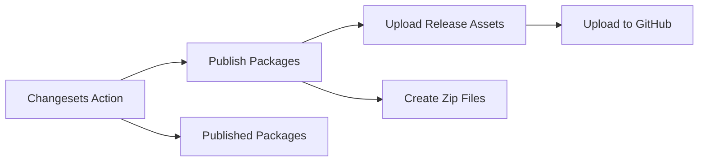

# Publishing Architecture

This document describes the publishing architecture for the Recursica monorepo, specifically how packages are published and release assets are created and uploaded to GitHub releases.

## Overview

The publishing system consists of two main phases:

1. **Publish Packages**: Creates zip files for packages that have publish commands (primarily Figma plugins)
2. **Upload Release Assets**: Uploads the created zip files as assets to GitHub releases

## Architecture Flow



## Components

### 1. Publish Packages (`scripts/publish.mjs`)

**Purpose**: Takes published package information from Changesets and creates zip files for packages that have publish commands.

**Input**: JSON array of published packages from Changesets
**Output**: JSON array of publish results with zip file paths

**Usage**:

```bash
node scripts/publish.mjs '<publishedPackagesJson>'

```

**Input Format**:

```json
[
  {
    "name": "@recursica/figma-plugin",
    "version": "1.2.3"
  },
  {
    "name": "@recursica/figma-plugin-test",
    "version": "1.2.3"
  }
]
```

**Output Format**:

```json
[
  {
    "name": "@recursica/figma-plugin",
    "version": "1.2.3",
    "zipPath": "/path/to/recursica-figma-plugin.zip"
  },
  {
    "name": "@recursica/figma-plugin-test",
    "version": "1.2.3",
    "zipPath": "/path/to/recursica-figma-plugin-test.zip"
  }
]
```

### 2. Upload Release Assets (`scripts/upload-release-assets.mjs`)

**Purpose**: Takes publish results and uploads the zip files as assets to the latest GitHub release.

**Input**: JSON array of publish results from the publish step
**Output**: Success/failure status for each upload

**Usage**:

```bash
node scripts/upload-release-assets.mjs '<publishResultsJson>'

```

**Input Format** (same as publish output):

```json
[
  {
    "name": "@recursica/figma-plugin",
    "version": "1.2.3",
    "zipPath": "/path/to/recursica-figma-plugin.zip"
  }
]
```

## Package-Specific Publish Scripts

### Figma Plugin (`apps/figma-plugin/scripts/publish.mjs`)

**Purpose**: Creates a production zip file for the main Figma plugin.

**Usage**:

```bash
node scripts/publish.mjs [production]

```

**Output**: Creates `recursica-figma-plugin.zip` in the `dist/` folder

### Figma Plugin Test (`apps/figma-plugin-test/scripts/publish.mjs`)

**Purpose**: Creates a test zip file for the test Figma plugin.

**Usage**:

```bash
node scripts/publish.mjs

```

**Output**: Creates `recursica-figma-plugin.zip` in the `dist/` folder

## GitHub Actions Integration

The publishing system is integrated into the GitHub Actions workflow in `.github/workflows/release.yml`:

```yaml
# Publish packages (create zip files for figma plugins)
- name: Publish Packages
  if: steps.changesets.outputs.published == 'true'
  id: publish-packages
  run: npm run publish -- '${{ steps.changesets.outputs.publishedPackages }}'

# Create and upload release assets for published packages
- name: Create and Upload Release Assets
  if: steps.changesets.outputs.published == 'true'
  run: node scripts/upload-release-assets.mjs '${{ steps.publish-packages.outputs.PUBLISH_RESULTS }}'
  env:
    GITHUB_TOKEN: ${{ secrets.GITHUB_TOKEN }}
```

## Testing

Use the test script to simulate the entire workflow locally:

```bash
# Dry run (default)
node scripts/test-release-workflow.mjs

# Test with specific packages
node scripts/test-release-workflow.mjs --packages @recursica/figma-plugin

# Test with actual uploads (requires GitHub CLI authentication)
node scripts/test-release-workflow.mjs --upload

```

## JSON Format Examples

### Published Packages Input (from Changesets)

```json
[
  {
    "name": "@recursica/figma-plugin",
    "version": "1.2.3"
  },
  {
    "name": "@recursica/figma-plugin-test",
    "version": "1.2.3"
  },
  {
    "name": "@recursica/ui-kit-mantine",
    "version": "2.1.0"
  }
]
```

### Publish Results Output

```json
[
  {
    "name": "@recursica/figma-plugin",
    "version": "1.2.3",
    "zipPath": "/Users/user/work/recursica/apps/figma-plugin/dist/recursica-figma-plugin.zip"
  },
  {
    "name": "@recursica/figma-plugin-test",
    "version": "1.2.3",
    "zipPath": "/Users/user/work/recursica/apps/figma-plugin-test/dist/recursica-figma-plugin.zip"
  }
]
```

Note: Only packages with publish commands (like Figma plugins) will appear in the publish results. NPM-only packages like `@recursica/ui-kit-mantine` are handled by Changesets directly.

## Error Handling

- **No packages to publish**: Scripts exit with code 0 and show info message
- **Missing zip files**: Upload script skips missing files and reports errors
- **GitHub upload failures**: Script exits with code 1 and shows error details
- **Invalid JSON**: Scripts validate input and exit with descriptive error messages

## Dependencies

- **GitHub CLI (`gh`)**: Required for uploading release assets
- **Node.js**: All scripts are Node.js-based for cross-platform compatibility
- **Turborepo**: Used for running publish commands across packages
- **Changesets**: Provides the published package information

## File Structure

```

scripts/
├── publish.mjs                    # Main publish orchestrator
├── upload-release-assets.mjs      # Asset upload handler
└── test-release-workflow.mjs      # Local testing script

apps/figma-plugin/scripts/
├── publish.mjs                    # Production plugin publisher
└── build-test.mjs                 # Test build script

apps/figma-plugin-test/scripts/
└── publish.mjs                    # Test plugin publisher

```
